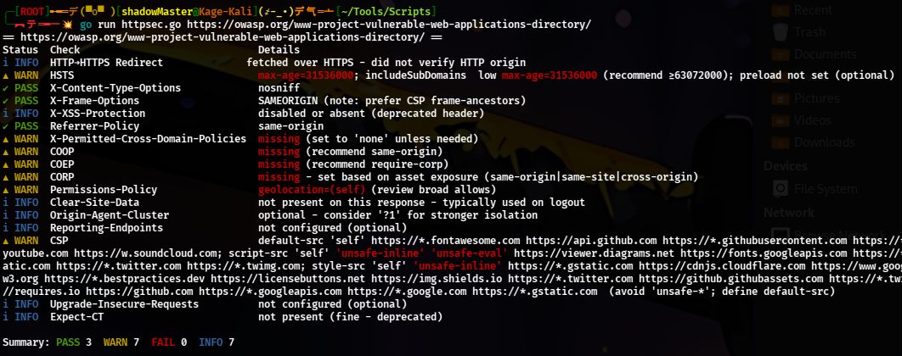
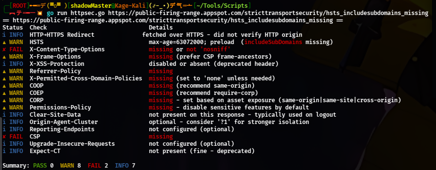
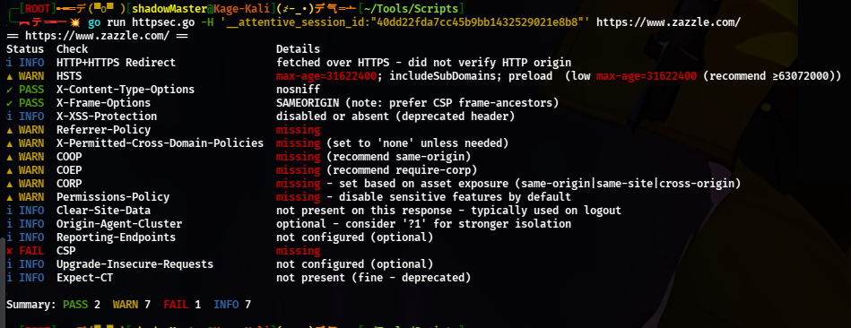

# HTTPSec

HTTPSec is a lightweight HTTP security header scanner written in Go.  
It identifies the presence and configuration quality of key security-related HTTP response headers, helping developers and security testers quickly spot misconfigurations.

## Features

- Scans for all major Mozilla-recommended HTTP security headers:
  - Strict-Transport-Security (HSTS)
  - Content-Security-Policy (CSP)
  - X-Content-Type-Options
  - X-Frame-Options
  - X-XSS-Protection
  - Cross-Origin-Embedder-Policy (COEP)
  - Cross-Origin-Opener-Policy (COOP)
  - Cross-Origin-Resource-Policy (CORP)
  - Permissions-Policy
  - Upgrade-Insecure-Requests
  - Reporting-Endpoints
  - X-Permitted-Cross-Domain-Policies
  - Expect-CT (deprecated)
  - Referrer-Policy
  - Clear-Site-Data
- Detects missing or misconfigured headers
- Color-coded PASS / WARN / FAIL / INFO output
- Highlights problematic values directly in the header string
- Lightweight and dependency-free
- Single-file executable - easy to run anywhere just `go run`

## Installation

Clone the repository:

```bash
git clone https://github.com/<your-username>/HTTPSec.git
cd HTTPSec
```

Usage
Run directly without building:

```bash
httpsec [flags] <url>

Flags:
  -h, --help    Show help message
```

Options

```bash
httpsec v1.1.0 - HTTP security headers checker

Usage:
  httpsec [flags] <url ...>
  httpsec [flags] -f urls.txt

Examples:
  httpsec https://example.com
  httpsec -probe-both https://example.com
  httpsec -f urls.txt -workers 8 -ci warn
  httpsec -json https://site1 https://site2
  httpsec -H "Cookie: session=xyz" https://intranet.local

Key flags:
  -ci           Exit non-zero if any issues: off|warn|fail
  -probe-both   When target is https, also probe http:// for redirect/HSTS
  -json         Emit JSON instead of pretty text
  -f FILE       Read URLs from file
  -workers N    Concurrency for multiple targets

Other flags:
  -H value
        extra request header, repeatable (e.g. -H 'Cookie: a=b')
  -X string
        HTTP method to use (GET/HEAD) (default "GET")
  -ci string
        exit non-zero if any: off|warn|fail (default "off")
  -f string
        path to file with URLs (one per line)
  -h    show help
  -help
        show help
  -insecure
        allow insecure TLS
  -json
        output JSON
  -probe-both
        when URL is https, also probe http:// origin for redirect/HSTS
  -timeout duration
        HTTP timeout (default 10s)
  -ua string
        user-agent (default "httpsec/1.1")
  -workers int
        concurrent workers for multiple URLs (default 4)

```

Screenshots
Sample Output - Status Column and Detailed Header Values

PoC 1


PoC 2


PoC 3


